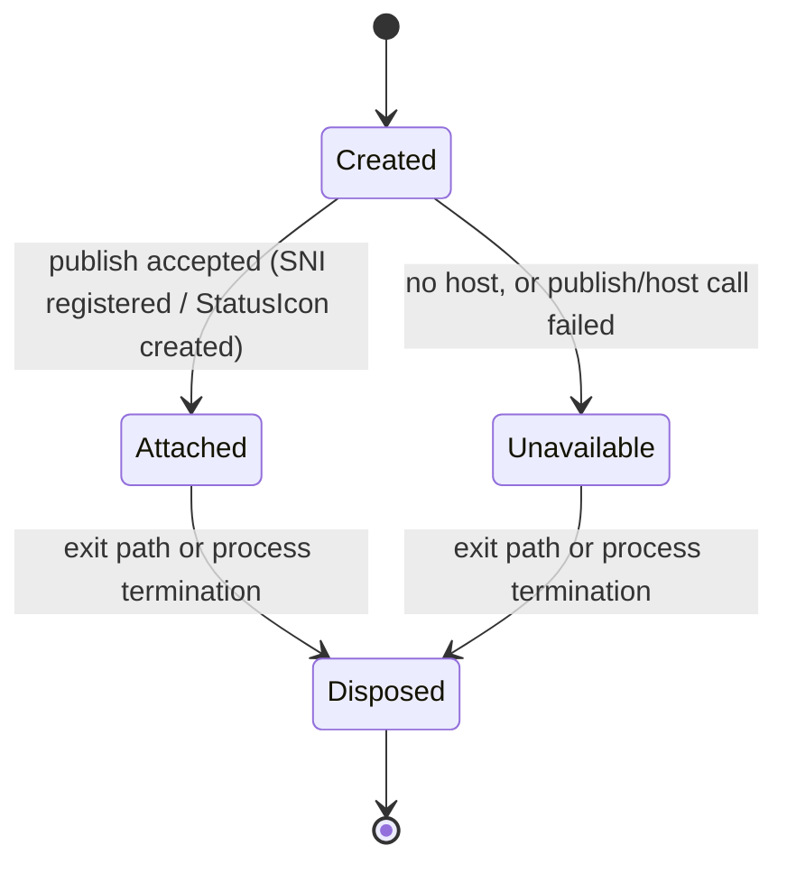

# Phase 1 Data Model: Background Instance Tray Icon

**Feature**: `specs/001-background-tray-icon/spec.md` | **Plan**: [plan.md](./plan.md) | **Research**: [research.md](./research.md)

The feature stores nothing on disk and adds no configuration. The model below describes the runtime objects the tray component owns, the invariants that implement the specification's requirements, and the protocol payloads it publishes to the desktop shell.

---

## 1. `TrayIcon` (runtime aggregate, one per process)

| Field | Type | Description | Notes |
|-------|------|-------------|-------|
| `BackendKind` | `TrayBackendKind` | Which mechanism is presenting the icon | Chosen once at attach time, never re-evaluated (FR-001) |
| `State` | `TrayIconState` | Lifecycle state | See state machine below |
| `MenuItems` | `IReadOnlyList<TrayMenuItem>` | The two menu entries | FR-005 |
| `Pixmaps` | `IReadOnlyList<TrayIconPixmap>` | Icon artwork variants | FR-008 |
| `TooltipText` | `string` | `"XDM"` | FR-008 |
| `Title` | `string` | `"Xtreme Download Manager"` | Shown by hosts that display a title |
| `FailureReason` | `string?` | Last attach failure, when `State == Unavailable` | Logged and used for diagnostics (FR-010) |

**Relationships**: `TrayIcon` is owned by `Program.Main` for the lifetime of the process; it refers to `ApplicationContext.MainWindow` (`IApplicationWindow`), `ApplicationContext.Application` (`RunOnUiThread`) and `ApplicationContext.CoreService` (`ActiveDownloadCount`) — none of which it owns or mutates beyond the documented actions (D5, D7).

**Invariant I1 (FR-001, SC-004)**: at most one `TrayIcon` exists per process, and a process attaches its icon only after the single-instance check has passed, so a user session shows exactly one icon and exactly one window.

**Invariant I2 (FR-001)**: `State` never returns to `Attached` after `Disposed`, and no window-visibility change may alter `State` — the icon is a property of the running instance, not of the window.

## 2. `TrayIconState`

| State | Meaning | Allowed transitions |
|-------|---------|---------------------|
| `Created` | Backend selected, icon not yet published | → `Attached` (publish succeeded) / → `Unavailable` (publish failed) |
| `Attached` | Icon published and visible to the shell | → `Disposed` |
| `Unavailable` | No usable host or publish failed; reason recorded and logged | → `Disposed` |
| `Disposed` | Icon removed / connection closed; terminal | — |

**Transition rules**

| Trigger | From | To | Side effects |
|---------|------|----|--------------|
| Attach after `ApplicationContext.Configure()` | `Created` | `Attached` | Icon + tooltip + menu published; `BackendKind` fixed |
| Attach failure (bus, registration, rasterisation) | `Created` | `Unavailable` | `FailureReason` set, `Log.Debug` entry, **no window shown** (FR-010, clarification Q4) |
| Tray "Exit" confirmed, or `TrayIcon.Dispose()` | `Attached`/`Unavailable` | `Disposed` | Unregister item, close connection, idempotent |
| Process death without `Dispose()` (crash, in-app Exit, session logoff) | any | — | The bus connection drops, so hosts remove the item; no code runs (FR-007) |

## 3. `TrayBackendKind`

| Value | Selected when | Requirement coverage |
|-------|---------------|---------------------|
| `Sni` | A status-notifier host is registered and registration succeeds | FR-001, FR-002, FR-003, FR-004, FR-005, FR-008, FR-009 |
| `LegacyStatusIcon` | No SNI host is available but the XEmbed tray can host `Gtk.StatusIcon` | Same requirements, except the host decides whether a primary click activates or opens the menu |
| `None` | Neither backend could publish an icon | FR-010 only: log, stay hidden |

**Rule**: exactly one kind per process (I1); `Sni` and `LegacyStatusIcon` must never both be published.

## 4. `TrayIconPixmap`

| Field | Type | Validation |
|-------|------|------------|
| `Width` | `int` | > 0 |
| `Height` | `int` | > 0 |
| `Argb32` | `byte[]` | `Length == Width * Height * 4`; byte order is network (big-endian) A,R,G,B per the StatusNotifierItem icon-pixmap chapter |

**Set published**: 22×22 and 44×44, both rasterised from `svg-icons/xdm-logo.svg` (D8). Validation failures mark the attach `Unavailable` rather than publishing a malformed icon.

## 5. `TrayMenuItem`

| Field | Type | Validation |
|-------|------|------------|
| `Id` | `uint` | Unique, stable across calls: `1` = restore, `2` = exit |
| `LabelKey` | `string` | `MSG_RESTORE`, `MENU_EXIT` |
| `Label` | `string` | `TextResource.GetText(LabelKey)`; non-empty because English is always loaded first (D10) |
| `Action` | enum | `RestoreWindow`, `ExitApplication` |

**Rules**: the layout is published with root id `0` and the two items in the order restore-then-exit, so a host that maps a primary click to the menu still lands on "Restore Window" first (risk mitigation in [plan.md](./plan.md)). `Event` calls for unknown ids or event ids other than `clicked` are ignored. The layout revision increments only when the published layout actually changes (it does not change during a session).

## 6. `RunningInstance` ↔ tray mapping (spec entity)

| Instance/window state | Icon state | Requirement |
|---|---|---|
| Starting in background (`--background`) | `Attached` once attach completes; window hidden | FR-002, SC-001 |
| Window closed/hidden by the user | `Attached`, unchanged | FR-002, FR-001 (no toggle) |
| Window minimized | `Attached`, unchanged | FR-001 |
| Window visible | `Attached`, unchanged | FR-001, clarification Q2 |
| Downloads in progress | `Attached`; exit action requires confirmation | FR-006, SC-007 |
| Process terminated (any cause) | Gone | FR-007, SC-005 |
| No tray host available | `Unavailable`, window stays hidden, log entry | FR-010, SC-006 |
