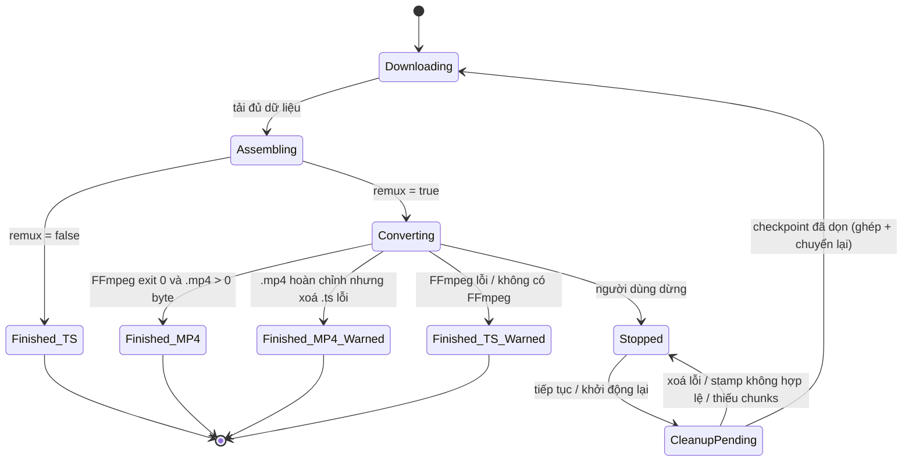

# Data Model: Chuyển video .ts sang .mp4 khi tải (remux)

**Feature**: [spec.md](./spec.md) | **Research**: [research.md](./research.md)

Tính năng không thêm bảng hay cột SQLite. Dữ liệu mới gồm cờ chuyển đổi, checkpoint output trong `.state` nhị phân và kết quả tạm thời của bước remux.

## 1. Cờ chuyển đổi trên mục tải

| Thuộc tính | Kiểu | Mặc định | Nơi lưu | Ghi chú |
|---|---|---|---|---|
| `SingleSourceHTTPDownloaderState.ConvertTsToMp4` | `bool` | `true` khi tạo mới; `false` khi đọc file `.state` cũ | `<DataDir>/<id>.state`, append sau `ConvertToMp3` | Link .ts trực tiếp, video HTTP bắt từ trình duyệt |
| `MultiSourceDownloadState.ConvertTsToMp4` | `bool` | như trên | `<DataDir>/<id>.state` của HLS, append sau field cũ cuối cùng | Chỉ HLS đọc/ghi; DASH kế thừa nhưng bỏ qua |
| `PendingRemuxTsPath` | `string` | rỗng | cả hai state, sau bool mới | Đường dẫn tuyệt đối TS đang assemble/remux thuộc lượt này |
| `PendingRemuxTsStamp` | `string` | rỗng | sau TS path | `length:creationTimeUtcTicks:lastWriteTimeUtcTicks`; rỗng khi writer chưa đóng |
| `PendingRemuxMp4Path` | `string` | rỗng | sau TS stamp | Đường dẫn MP4 đã reserve theo conflict policy |
| `PendingRemuxMp4Stamp` | `string` | rỗng | sau MP4 path | Cùng định dạng stamp TS, chốt sau process đóng |

**Quy tắc**

- Giá trị lấy từ checkbox của hộp thoại tải, hoặc `true` nếu download được tạo không qua hộp thoại (research D7).
- Ghi kèm mỗi lần `SaveState()` hoặc `SaveForLater()`; còn hiệu lực khi tạm dừng, tiếp tục hay khởi động lại XDM (FR-010).
- Đọc theo kiểu tuỳ chọn: bản ghi thiếu byte cuối → `false` (research D8).
- EOF trước bool: state cũ → false và checkpoint rỗng. EOF ngay sau bool: state chỉ có cờ → checkpoint rỗng. Có bytes checkpoint thì phải đọc đủ cả bốn string; chuỗi/bản ghi bị cắt hỏng không được nuốt lỗi và coi là rỗng. Giữ dữ liệu, báo state lỗi, không rename/cleanup theo đường dẫn suy đoán.
- Khi AutoRename, reserve output bằng CreateNew; khi Overwrite, chỉ mở file chính sách đã cho phép. Save path/stamp rỗng trước ghi; sau đóng handle cập nhật stamp/save. Checkpoint save lỗi chặn ghi dữ liệu hoặc hoàn tất, giữ chunks. Chỉ áp dụng cho nhánh TS-remux, không đổi các downloader khác.
- Khi Cancelled, path/stamp còn hiệu lực đến khi file xoá được/vắng; clear và save riêng từng entry. Converted/Failed đi tới Completed thì clear checkpoint, kể cả khi có cảnh báo cleanup; file kết quả không được xem là rác cho Resume.
- `ConvertToMp3 == true` thì không bao giờ remux (tên đích đã là `.mp3`).

## 2. Điều kiện kích hoạt (lúc assemble)

```text
remux := ConvertTsToMp4
         AND lower(Path.GetExtension(TargetFileName)) == ".ts"
         AND ProbeTs xác nhận định dạng MPEG-TS và có video đọc được
```

Cờ tắt/đuôi khác → không chạy probe/remux. `LooksLikeMpegTs` chỉ là hint: tìm 5 sync byte cách nhau 188 byte ở offset bất kỳ trong buffer đầu tối đa 1 MiB. Hint true → forced MPEGTS probe; hint false → auto-probe rồi forced fallback nếu chưa xác nhận được video TS, kể cả khi auto-probe lỗi/nhận định dạng khác. Chỉ metadata MPEGTS có codec video xác định và độ phân giải dương mới xác nhận video; header do ép demuxer không đủ. File văn bản nhỏ được kiểm tra toàn bộ hoặc cả hai phép probe không có bằng chứng video TS → `Skipped`, không báo lỗi; có bằng chứng TS nhưng đọc/xử lý lỗi → `Failed`. Không sửa hoặc cắt prefix của nguồn. Xem research D3/D12.

## 3. Vòng đời file và trạng thái mục tải



| Trạng thái | File trong thư mục đích | `TargetFileName` / kích thước báo cho `ApplicationCore` | Thông báo |
|---|---|---|---|
| Converting | `<tên>.ts` (đầy đủ) + `<tên>.mp4` (đang ghi) | chưa báo | Progress window: `STAT_ASSEMBLING` |
| Finished_MP4 | chỉ `<tên>.mp4` (`.ts` đã xoá, FR-015) | `<tên>.mp4` / kích thước `.mp4` | Hộp thoại hoàn tất (nếu bật) trỏ tới `.mp4` |
| Finished_MP4_Warned | `.mp4` hoàn chỉnh + `.ts` không xoá được | `.mp4` / kích thước `.mp4` | Cảnh báo lỗi xoá `.ts`, lý do và đường dẫn; mục tải vẫn hoàn tất |
| Finished_TS_Warned | chỉ `<tên>.ts` (`.mp4` dở dang đã xoá) | `<tên>.ts` / kích thước `.ts` | `MSG_TS_TO_MP4_FAILED` + lý do, hoặc `MSG_FFMPEG_MISSING` |
| Finished_TS_Warned, lỗi cleanup | `.ts` nguyên vẹn + `.mp4` dở dang không xoá được | `.ts` / kích thước `.ts` | Báo cả lỗi chuyển đổi và lỗi xoá, kèm đường dẫn `.mp4`; mục tải vẫn hoàn tất |
| Stopped (huỷ khi đang chuyển) | không còn `.ts` lẫn `.mp4` của lượt này; piece/segment tạm vẫn giữ | không báo finished | không (trạng thái dừng như thường) |
| Stopped, cleanup bị chặn | `.ts` và/hoặc `.mp4` còn sót, path/stamp giữ trong state; piece/segment vẫn giữ | không báo finished, không xoá chunks | Cảnh báo đường dẫn và lý do; Resume còn lỗi → Stopped, không AutoRename/tạo output mới |

`<tên>.mp4` được chọn theo `Config.Instance.FileConflictResolution`: `AutoRename` → GetUniqueFileName rồi reserve CreateNew, retry nếu vừa bị chiếm; `Overwrite` → ghi đè theo chính sách đã chọn. `.ts` của nhánh remux cũng reserve trước ghi. Retry checkpoint diễn ra trước HLS ProbeTarget và trước chọn tên ở cả hai downloader; không suy ra file rác từ basename hay glob. Chỉ xoá file khớp stamp trong TargetDir lưu bền khi đủ chunks khôi phục. File đã vắng thì clear entry; stamp khác/chưa chốt hoặc thiếu chunks thì giữ Stopped để người dùng xử lý file còn sót. Xem research D16 về giới hạn metadata stamp.

## 4. Kết quả remux (trong bộ nhớ, không lưu)

| Field | Kiểu | Ý nghĩa |
|---|---|---|
| `Outcome` | `Skipped` \| `Converted` \| `Failed` \| `Cancelled` | Kết quả cuối |
| `FinalFile` | `string` | Đường dẫn file kết quả (`.mp4` khi `Converted`, `.ts` khi `Skipped`/`Failed`) |
| `FileSize` | `long` | Kích thước `FinalFile` |
| `Reason` | `string?` | `MediaProcessor.LastError` hoặc lý do bỏ qua; dùng cho log và thông báo |
| `CleanupWarning` | chuỗi tạm, có thể không có | Lý do và đường dẫn không xoá được; không đổi Outcome/FinalFile. Câu cảnh báo không lưu; path/stamp của Cancelled lưu qua checkpoint |

Các tên field kết quả mô tả dữ liệu xử lý, không bắt buộc tạo DTO mới. `Run` giữ enum + out parameters và callback checkpoint MP4 về caller; cảnh báo được dựng trong helper. `Cancelled` không có FinalFile dùng cho Completed. Dữ liệu probe gồm định dạng, video hợp lệ và catalog stream index/type/codec; mapping FFmpeg dùng để log stream bị bỏ. Số đo elapsed/CPU chỉ ghi log, không thêm cột DB hoặc setting.

Chi tiết hợp đồng: [contracts/ts-to-mp4-remuxer.md](./contracts/ts-to-mp4-remuxer.md).
