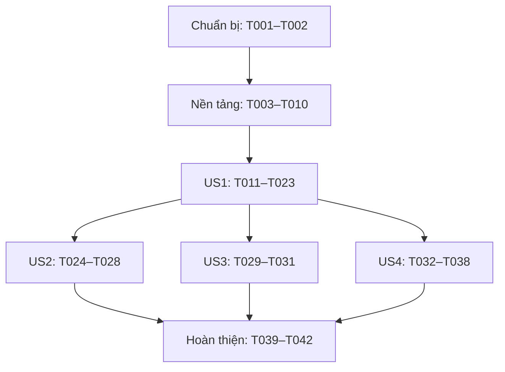

# Công việc: Chuyển video .ts sang .mp4 khi tải (remux, không mã hoá lại)

**Đầu vào**: [spec.md](./spec.md), [plan.md](./plan.md), [research.md](./research.md), [data-model.md](./data-model.md), [contracts/](./contracts/), [quickstart.md](./quickstart.md).
**Cập nhật**: 2026-10-04, theo D1–D16/G1–G11; thay thế danh sách 41 task chưa triển khai. Branch Git hiện tại `master`, feature được chọn `002-ts-to-mp4-remux`.
**Kiểm chứng**: Các Independent Test/Acceptance Scenarios và bộ mẫu bắt buộc SC-001 trong spec là tiêu chí; dùng kiểm thử NUnit tập trung theo D11 và QA desktop theo quickstart để kiểm chứng hành vi. Không áp dụng TDD cho toàn repo, không chạy toàn suite.
**Tổ chức**: 7 giai đoạn; US1/US2 P1, US3/US4 P2. Không sửa spec hoặc thiết kế trong lượt sinh task.

## Định dạng và quy ước

- Mỗi task dùng `- [ ] TNNN [P?] [USn?] Mô tả kèm đường dẫn`. Setup/nền tảng/hoàn thiện không gắn story; task trong story luôn có nhãn.
- `[P]` chỉ được chạy đồng thời khi phụ thuộc đã hoàn tất và file khác nhau; không có nghĩa mọi task mang [P] chạy cùng lượt. Thứ tự ID là mặc định.
- Đường dẫn tính từ repo root. Core dùng C# 9/API net4.7.2 và net6.0; GTK giữ `LINUX;TRACE`, publish trim/handler trực tiếp; WPF giữ `TRACE;WINDOWS`.
- Constitution hiện là template chưa điền; gate có hiệu lực từ spec/AGENTS.md và plan G1–G11. Không thêm package/setting/SQLite migration/macOS. Không sửa `docs/` để ghi tài liệu dev.
- Mọi checkbox còn trống: chưa triển khai. SDK/GTK3 hiện thiếu; task nghiệm thu phải ghi chưa chạy nếu điều kiện chưa đáp ứng.

## Giai đoạn 1: Chuẩn bị dùng chung

**Mục tiêu**: Chuẩn bị chuỗi và khung mã nguồn trong cấu trúc hiện có; không tạo project/package mới.

- [ ] T001 Thêm đúng ba khoá LBL_CONVERT_TO_MP4, MSG_TS_TO_MP4_FAILED và MSG_TS_TO_MP4_CLEANUP_FAILED vào `app/XDM/Lang/English.txt`, lấy giá trị từ `specs/002-ts-to-mp4-remux/contracts/download-dialog-option.md`; câu cleanup là “XDM could not delete the following file.”, dùng được cho Completed và Stopped. Không sửa ngôn ngữ khác (FR-001, FR-008, FR-015; D10).
- [ ] T002 [P] Tạo khung `app/XDM/XDM.Core/Downloader/MediaProcessor/TsToMp4Remuxer.cs` với enum/chữ ký theo contract và đăng ký Compile Include trong `app/XDM/XDM.Core/XDM.Core.projitems`; giữ C# 9/API net4.7.2, không đổi framework. Khung chưa triển khai phải thể hiện chưa hỗ trợ thay vì báo Success giả; T007/T009/T010 hoàn thiện logic (G3, G8).

## Giai đoạn 2: Nền tảng bắt buộc

**Mục tiêu**: Hoàn thành API, probe/fallback, pipeline bảo toàn dữ liệu và checkpoint trước mọi story. Các cơ chế lỗi/dừng cơ bản nằm ở đây để MVP an toàn.

- [ ] T003 [P] Thêm ProbeTs và RemuxTsToMp4 vào `app/XDM/XDM.Core/Downloader/MediaProcessor/BaseMediaProcessor.cs` theo chữ ký trong contract, khai báo tương ứng trong `app/XDM/XDM.Core/Downloader/MediaProcessor/FFmpegMediaProcessor.cs` để mọi lớp con vẫn biên dịch. Giữ quoting hiện có, FindFFmpegBinary, WaitForExit/Kill tương thích net4.7.2; T008 triển khai (FR-003, FR-004; D14).
- [ ] T004 [P] Thêm ConvertTsToMp4 kiểu bool vào state trong `app/XDM/XDM.Core/Downloader/Progressive/SingleHttp/SingleSourceHTTPDownloader.cs` và `app/XDM/XDM.Core/Downloader/Adaptive/MultiSourceDownloaderBase.cs`, giữ nguyên ràng buộc “`true` khi tạo mới; `false` khi đọc file `.state` cũ”. Thêm bốn string PendingRemuxTsPath, PendingRemuxTsStamp, PendingRemuxMp4Path, PendingRemuxMp4Stamp, mặc định “rỗng”; path TS là “Đường dẫn tuyệt đối TS đang assemble/remux thuộc lượt này”, path MP4 là “Đường dẫn MP4 đã reserve theo conflict policy”. Stamp TS: “`length:creationTimeUtcTicks:lastWriteTimeUtcTicks`; rỗng khi writer chưa đóng”; MP4: “Cùng định dạng stamp TS, chốt sau process đóng”. Không bật cờ resume bằng initializer (FR-010, FR-016; data-model §1).
- [ ] T005 Viết kiểm thử hành vi trong `app/XDM/XDM.Tests/TsToMp4RemuxerTests.cs`: ShouldRemux, sync hint, parser Input MPEGTS/video codec khác none/unknown và width/height >0, auto-probe lỗi/nhầm định dạng phải fallback, không chấp nhận header ép MPEGTS đơn thuần; args chỉ copy; state cũ/true/false/checkpoint round-trip và nhóm checkpoint bị cắt hỏng. Dùng fake processor, fixture tạm, không Ignore test thuần; sau T003/T004, kiểm tra các ca chưa được hỗ trợ trước T006–T010 (FR-003, FR-004, FR-010; Independent Test/SC-001).
- [ ] T006 Cập nhật `app/XDM/XDM.Core/IO/DownloadStateIO.cs`: append ConvertTsToMp4, PendingRemuxTsPath, PendingRemuxTsStamp, PendingRemuxMp4Path, PendingRemuxMp4Stamp cho SingleHttp/Hls. Giữ nguyên: “EOF trước bool: state cũ → false và checkpoint rỗng. EOF ngay sau bool: state chỉ có cờ → checkpoint rỗng.” Có bytes checkpoint thì đọc đủ bốn string; không nuốt chuỗi/nhóm bị cắt hỏng hoặc lỗi trường cũ. Dùng writer transaction hiện có; không đổi DASH/SQLite. Sau T005, chạy nhóm state (FR-010; D8/D16).
- [ ] T007 [P] Triển khai ShouldRemux và LooksLikeMpegTs trong `app/XDM/XDM.Core/Downloader/MediaProcessor/TsToMp4Remuxer.cs`: flag + đuôi .ts OrdinalIgnoreCase; ít nhất 5 sync 0x47 cách nhau 188 byte ở offset bất kỳ trong buffer đầu tối đa 1 MiB. False chỉ là hint, không loại đầu vào; chỉ skip văn bản nhỏ khi đã kiểm tra toàn bộ và không có hint TS, kể cả thiếu FFmpeg. Giữ nguồn/prefix nguyên vẹn; sau T005, khác file T006/T008 (FR-003; D3).
- [ ] T008 [P] Triển khai ProbeTs/RemuxTsToMp4 và parser metadata trong `app/XDM/XDM.Core/Downloader/MediaProcessor/FFmpegMediaProcessor.cs`: hint true → forced MPEGTS; false → auto-probe rồi forced fallback nếu chưa xác nhận video TS, kể cả lỗi/định dạng khác. Kiểm tra cancellation trước fallback, chỉ nhận codec xác định + độ phân giải dương; exit 1 thiếu output không tự là lỗi. Remux dùng `-hide_banner -nostdin -f mpegts -i <in> -map 0:v? -map 0:a? -c copy <out> -y`; không encode/faststart/ffprobe runtime. Giữ catalog của lượt xác nhận; sau T005, khác file T006/T007 (FR-003, FR-004; D12).
- [ ] T009 Triển khai Run trong `app/XDM/XDM.Core/Downloader/MediaProcessor/TsToMp4Remuxer.cs` theo contract sau T006–T008: outcome “`Skipped` | `Converted` | `Failed` | `Cancelled`”; FinalFile là “Đường dẫn file kết quả (`.mp4` khi `Converted`, `.ts` khi `Skipped`/`Failed`)”, FileSize là “Kích thước `FinalFile`”; Cancelled không có file dùng cho Completed. Chọn MP4 cùng thư mục, AutoRename reserve CreateNew/retry tên vừa bị chiếm, Overwrite theo policy. Gọi checkpointMp4(path, stamp) trước ghi/sau đóng process; save lỗi → Cancelled/cleanup-block. Success cần exit 0/output >0; Failed giữ TS, dọn MP4; success dọn TS lỗi vẫn Converted, failure dọn MP4 lỗi vẫn Failed. Dùng UI thread, ba resource key, Confirm/OpenBrowser khi thiếu FFmpeg; Application=null chỉ log. Reason kiểu string? là “`MediaProcessor.LastError` hoặc lý do bỏ qua; dùng cho log và thông báo”; CleanupWarning là “chuỗi tạm, có thể không có”, giữ quy tắc “không đổi Outcome/FinalFile. Câu cảnh báo không lưu; path/stamp của Cancelled lưu qua checkpoint” (FR-005, FR-008, FR-011, FR-015; D4/D6).
- [ ] T010 Triển khai TryCleanupPendingOutputs trong `app/XDM/XDM.Core/Downloader/MediaProcessor/TsToMp4Remuxer.cs` sau T009: nhận path/stamp và callback clearPending(bool), kiểm tra file khớp metadata; file đã vắng thì clear/save từng entry. Stamp rỗng/khác hoặc lỗi IO giữ entry, trả false và cảnh báo đường dẫn/lý do; không glob/tìm tên suy đoán. Chỉ dùng cho output thuộc lượt này trong TargetDir và đủ chunks khôi phục, caller kiểm tra trước khi gọi. Dùng delegate xoá internal mặc định File.Delete để kiểm chứng; không thêm filesystem service. Không clear checkpoint Cancelled còn tồn tại; Converted/Failed đi tới Completed clear checkpoint mà không xoá file kết quả (FR-016, SC-005; D16).

## Giai đoạn 3: US1 — Tải video .ts và nhận .mp4 (P1), MVP

**Mục tiêu**: HTTP/HLS cho ra MP4 với checkbox mặc định bật trên GTK/WPF; hỗ trợ prefix dài, hiển thị Assembling, metadata/Open file đúng.

**Kiểm chứng độc lập**: Quickstart §2, §7 E8/E9/E11, §8/§9: HTTP và HLS muxed, TS chuẩn/prefix 187, 65.537 và 1.048.577 byte; giữ video/audio/codec/độ phân giải, duration lệch ≤1 s, xoá TS sau success bình thường. Dialog mới mặc định bật, không click bổ sung; mục tải chỉ Completed sau output sẵn sàng.

- [ ] T011 [US1] Bổ sung kiểm thử FFmpeg thật trong `app/XDM/XDM.Tests/TsToMp4RemuxerTests.cs`: TS MPEG-2/AC-3 chuẩn và prefix 187, 65.537, 1.048.577 byte; mẫu vượt buffer có hint false/auto-probe không xác nhận vẫn remux được video và audio. So codec/độ phân giải/duration ≤1 s/packet count, không chỉ kiểm tra file tồn tại; TypeScript và sync giả không tạo MP4. Chỉ Ignore phần tích hợp khi thiếu FFmpeg; sau giai đoạn 2 (FR-003; SC-001, SC-004).
- [ ] T012 [P] [US1] Thêm ShowConvertToMp4Checkbox, IsConvertToMp4Checked và FileNameChangedEvent vào `app/XDM/XDM.Core/UI/INewDownloadDialog.cs` và `app/XDM/XDM.Core/UI/INewVideoDownloadDialog.cs` theo contract; không sửa IFileSelectable. Sau giai đoạn 2, khác file T011 (FR-001, FR-014).
- [ ] T013 [US1] Sửa `app/XDM/XDM.Core/Downloader/Progressive/SingleHttp/SingleSourceHTTPDownloader.cs` sau T011: ctor cuối convertTsToMp4=true chỉ cho lượt mới; retry checkpoint ngay sau RestoreState và trước SortAndValidatePieces/rename. Nhánh TS-remux reserve TS theo policy, save path trước ghi, đóng/flush outfs rồi chốt stamp/save trước Run; callback MP4 save dưới lock đang giữ. Dùng cờ/tên cuối, bỏ qua khi MP3; Converted cập nhật tên/totalSize/timestamp, Failed/Skipped giữ TS. Cancelled/cleanup-block đặt cancellation, phát OnCancelled một lần, giữ chunks; guard Resume trước base.OnFinished. Đủ chunks/path hợp lệ mới retry; mismatch/IO/save lỗi giữ Stopped (FR-006, FR-007, FR-010, FR-013, FR-016; D5/D16).
- [ ] T014 [US1] Thêm guard cancellation trước Finished ở OnPieceCompleted/OnFinished trong `app/XDM/XDM.Core/Downloader/Progressive/HTTPDownloaderBase.cs` sau T013; return từ AssemblePieces không đủ vì caller vẫn gọi Finished. Không Finished/DeleteFileParts khi bị dừng/cleanup-block; không phát OnCancelled hai lần nếu Stop đã phát. Kiểm tra nhánh thành công DualSource vẫn giữ hành vi hiện có; không sửa trực tiếp DualSource (FR-016; SC-005; D16).
- [ ] T015 [P] [US1] Sửa `app/XDM/XDM.Core/Downloader/Adaptive/Hls/MultiSourceHLSDownloader.cs` và `app/XDM/XDM.Core/Downloader/Adaptive/MultiSourceDownloaderBase.cs` sau T011, có thể cùng T013: ctor mới mặc định true; retry checkpoint sau RestoreState trước OnStarted/Init/ProbeTarget và trước rename. Nhánh !Demuxed reserve/save TS, ConcatSegments đóng handle rồi chốt stamp, Run trước DeleteFileParts; cập nhật tên/FileSize/timestamp khi Converted. Guard cả hai caller Assemble và OnComplete; cleanup-block đặt cancellation/OnCancelled một lần rồi return, không throw vào catch dùng _cancelRequestor chưa tạo. Giữ segments, cờ và checkpoint; không đổi DASH (FR-006, FR-007, FR-010, FR-013, FR-016; D16).
- [ ] T016 [US1] Thêm tham số cuối convertTsToMp4=true vào StartDownload trong `app/XDM/XDM.Core/IApplicationCore.cs` và `app/XDM/XDM.Core/ApplicationCore.cs`, truyền vào ctor HTTP/HLS mới; resume dùng state, batch/tự tải/RestartDownload tạo mới nhận mặc định true. Sau T013/T015, giữ public API ngoài phạm vi theo plan (FR-002, FR-010, FR-013; D7/D8).
- [ ] T017 [US1] Thêm tham số cuối convertTsToMp4=true vào StartVideoDownload trong `app/XDM/XDM.Core/IVideoTracker.cs`, `app/XDM/XDM.Core/BrowserMonitoring/VideoTracker.cs` và `app/XDM/XDM.Core/BrowserMonitoring/CapturedVideoTracker.cs`; truyền cờ cho HTTP/HLS, kiểm tra mọi implementation/caller. Sau T016 (FR-013).
- [ ] T018 [US1] Cập nhật `app/XDM/XDM.Core/UI/NewDownloadDialogUIController.cs` và `app/XDM/XDM.Core/UI/NewVideoDownloadDialogUIController.cs` sau T012/T016/T017: mỗi dialog mới tick true, hiện theo tên .ts/MIME không phân biệt hoa thường, cập nhật khi đổi tên/URL/video/MP3 và trước Download/Download Later. Truyền tick kể cả khi ẩn; giữ nguyên bất biến “nếu người dùng đã bỏ tick thì giữ false khi đổi .ts → .mp4 → .ts trong cùng dialog”. Không sửa tên trong handler gây vòng lặp/setting nhớ lần trước (FR-001, FR-002, FR-009, FR-013).
- [ ] T019 [P] [US1] Thêm GtkCheckButton id chkConvertToMp4 mặc định ẩn vào `app/XDM/XDM.Gtk.UI/glade/new-download-window.glade` và `app/XDM/XDM.Gtk.UI/glade/new-video-download-window.glade`; controller quyết định visibility, nhãn dịch qua code dialog. Sau T001/T012, có thể cùng T021 (FR-001, FR-014).
- [ ] T020 [US1] Triển khai hai property, field [UI] đúng id và FileNameChangedEvent từ TxtFile.Changed bằng handler trực tiếp trong `app/XDM/XDM.Gtk.UI/Dialogs/NewDownload/NewDownloadWindow.cs` và `app/XDM/XDM.Gtk.UI/Dialogs/NewVideoDownload/NewVideoDownloadWindow.cs`; dịch nhãn qua LBL_CONVERT_TO_MP4, không reset tick khi ẩn. Sau T019 (FR-001, FR-014; G5).
- [ ] T021 [P] [US1] Thêm CheckBox ChkConvertToMp4, Content StaticResource LBL_CONVERT_TO_MP4, Visibility Collapsed vào `app/XDM/XDM.Wpf.UI/Dialogs/NewDownload/NewDownloadWindow.xaml` và `app/XDM/XDM.Wpf.UI/Dialogs/NewVideoDownload/NewVideoDownloadWindow.xaml`; sau T001/T012, khác file T019 (FR-001, FR-014).
- [ ] T022 [US1] Triển khai hai property và FileNameChangedEvent từ TxtFile.TextChanged bằng handler có tên trong `app/XDM/XDM.Wpf.UI/Dialogs/NewDownload/NewDownloadWindow.xaml.cs` và `app/XDM/XDM.Wpf.UI/Dialogs/NewVideoDownload/NewVideoDownloadWindow.xaml.cs`; visibility không reset tick. Sau T021 (FR-001, FR-014).
- [ ] T023 [US1] Chạy US1 theo `specs/002-ts-to-mp4-remux/quickstart.md` §0/§2/§7 E8/E9/E11/§8/§9 sau T014/T018/T020/T022: HTTP/HLS muxed, bốn dialog, default/tên sửa tay, TS chuẩn/cả ba prefix, metadata/Open file/folder và Assembling trước Completed. Dùng GTK publish trim và WPF Windows; ghi nguồn fixture, build/host, kết quả hoặc điều kiện chưa chạy vào `specs/002-ts-to-mp4-remux/tasks.md` (FR-001–FR-007, FR-013–FR-015; SC-001, SC-004, SC-006).

**Mốc MVP**: US1 dùng pipeline an toàn của giai đoạn 2, gồm cleanup/cancellation/checkpoint; có thể trình diễn sau T023 đạt. Nghiệm thu feature cần đủ cả bốn story và giai đoạn 7.

## Giai đoạn 4: US2 — Remux nhanh, gần như không tốn CPU (P1)

**Mục tiêu**: Đo pipeline XDM và ghi rõ stream bị bỏ, giữ nguyên các stream được map bằng copy.

**Kiểm chứng độc lập**: Quickstart §3: mỗi mẫu 0,95–1,05 GB, E≤2C, tổng CPU từng lượt ≤5% duration; hai mẫu chênh dung lượng ≤5%, duration khác ≥2 lần, R≤1,25. Nhóm có (max-min)/median>0,20 chưa kết luận. Codec/độ phân giải/packet count giữ nguyên, duration lệch ≤1 s.

- [ ] T024 [US2] Bổ sung test trong `app/XDM/XDM.Tests/TsToMp4RemuxerTests.cs` sau US1: catalog Input dedup Program, mapping thiếu không đồng nghĩa không có stream bỏ, Subtitle/Data không map được log đủ index/type/codec/lý do; mọi stream video/audio được map đều copy. Kiểm tra correlation/tổng CPU gồm auto-probe và forced fallback, không ghi CPU giả khi đo lỗi; trước T025/T026 (FR-004, FR-012; SC-003, SC-004).
- [ ] T025 [US2] Bổ sung callback/parser và log riêng probe/remux trong `app/XDM/XDM.Core/Downloader/MediaProcessor/FFmpegMediaProcessor.cs` sau T024: từng input stream không map ghi index/type/codec/lý do; thiếu mapping log không xác định. Sau WaitForExit, trước Dispose ghi step=probe|remux/input/cpu_ms từ TotalProcessorTime cho mọi process kể cả fallback. Giữ raw stderr, không thay semantics merge/MP3 hoặc tự encode khi codec lỗi (FR-012; SC-003; D13).
- [ ] T026 [P] [US2] Đo Stopwatch và log outcome/input/output/elapsed_ms/input_bytes/output_bytes trong `app/XDM/XDM.Core/Downloader/MediaProcessor/TsToMp4Remuxer.cs` sau T024, song song T025: khoảng đo từ trước detector đến sau cleanup, trước thông báo UI. Correlation theo lượt input để cộng đủ CPU; không lấy số đo FFmpeg độc lập làm elapsed XDM (FR-012; SC-002, SC-003).
- [ ] T027 [US2] Đo big.ts/long.ts theo `specs/002-ts-to-mp4-remux/quickstart.md` §3 sau T025/T026: ghi byte/duration/ổ/cache và 3 lượt mỗi nhóm XDM/copy flush không reflink. E=median elapsed_ms, C=median copy_ms, B=input_bytes; cả hai E≤2C, R=(E_long/B_long)/(E_big/B_big)≤1,25. Mỗi nhóm (max-min)/median≤0,20; nhiễu lớn → chưa kết luận và đo lại cả cặp, nhóm ổn định mà R>1,25 → không đạt. Tổng CPU tất cả probe/fallback/remux mỗi lượt ≤5% duration×1000. Ghi bảng/số đo gốc vào `specs/002-ts-to-mp4-remux/tasks.md`, không dùng top hoặc ffmpeg riêng thay log XDM (SC-002, SC-003; D15/G11).
- [ ] T028 [US2] Kiểm chứng luồng/chất lượng theo `specs/002-ts-to-mp4-remux/quickstart.md` §3/§7 E10 sau T025/T026: dùng ffprobe QA so codec/độ phân giải/duration ≤1 s, packet count và frame count khi phù hợp, mapping copy; fixture Subtitle/Data có log từng stream bỏ. Không so bitrate container TS với MP4. Ghi nguồn/kết quả vào `specs/002-ts-to-mp4-remux/tasks.md` (FR-004, FR-012; SC-004).

## Giai đoạn 5: US3 — Bỏ tick để giữ .ts (P2)

**Mục tiêu**: Giữ lựa chọn false qua Download Later/Stop/restart/Resume; dialog mới lại mặc định bật.

**Kiểm chứng độc lập**: Quickstart §4/§7 E6/E8 trên cả dialog thường/video GTK/WPF: bỏ tick → chỉ TS và không process probe/remux; đổi .ts→.mp4→.ts vẫn false; mở dialog mới true.

- [ ] T029 [US3] Bổ sung test trong `app/XDM/XDM.Tests/TsToMp4RemuxerTests.cs` sau US1: cờ false không gọi ProbeTs/RemuxTsToMp4, không reserve/tạo MP4/checkpoint mới; state false round-trip và caller resume giữ false. Kiểm tra side effect thực tế bằng fake processor/fixture, không chỉ assert ShouldRemux=false (FR-009, FR-010).
- [ ] T030 [US3] Kiểm tra và hoàn thiện đường truyền false/Download Later trong `app/XDM/XDM.Core/UI/NewDownloadDialogUIController.cs` và `app/XDM/XDM.Core/UI/NewVideoDownloadDialogUIController.cs` theo kết quả T029: ẩn checkbox không reset lựa chọn, đổi tên/video/MP3 không bật lại, dialog mới reset true; không thêm cài đặt chung. Giữ hành vi đã có ở T018 nếu kiểm chứng đạt (FR-002, FR-009; contract dialog).
- [ ] T031 [US3] Chạy `specs/002-ts-to-mp4-remux/quickstart.md` §4/§7 E6/E8 sau T030 trên hai dialog GTK/WPF, gồm bỏ tick, sửa tên, Download Later, Stop/restart/Resume. Xác nhận chỉ TS, không probe/remux, lựa chọn false lưu đúng và dialog mới true; ghi bằng chứng vào `specs/002-ts-to-mp4-remux/tasks.md` (FR-002, FR-009, FR-010).

## Giai đoạn 6: US4 — Lỗi chuyển đổi và Stop/Resume an toàn (P2)

**Mục tiêu**: Nghiệm thu các nhánh bảo toàn dữ liệu đã triển khai ở nền tảng/downloader: Failed hoàn tất TS, Converted cleanup lỗi vẫn MP4; Cancelled/cleanup-block giữ Stopped/chunks/checkpoint.

**Kiểm chứng độc lập**: Quickstart §5/§6/§10 và §7 E1/E2/E4–E7: codec lỗi/thiếu binary/cleanup lỗi, Stop rồi Resume nhiều lần và restart. Lỗi quyền còn → Stopped, không Finished/rename/output mới; khôi phục quyền → dọn đúng entry và hoàn tất đúng cờ, không file trùng.

- [ ] T032 [US4] Bổ sung test lỗi trong `app/XDM/XDM.Tests/TsToMp4RemuxerTests.cs` sau US1: AppNotFound, codec/probe lỗi, output 0 byte, IO tạo output/hết chỗ; dọn TS lỗi sau Converted vẫn final MP4, dọn MP4 lỗi sau Failed vẫn final TS. Assert TS nguyên vẹn, finalSize đúng, thông báo/log giữ cả lý do chuyển đổi và cleanup/path; Application=null chỉ log. Dùng fake media processor/delegate File.Delete internal; hoàn thiện các nhánh T009 nếu ca yêu cầu chưa đạt (FR-008, FR-015; SC-005).
- [ ] T033 [US4] Viết test cancellation/caller trong `app/XDM/XDM.Tests/TsToMp4RemuxerTests.cs` sau T032: dừng trước probe/giữa fallback/remux/sau process; process phải kill/wait trước cleanup, không Finished/DeleteFileParts, không double OnCancelled. Phủ HTTP mới/Resume và HLS mới/Resume, cleanup lỗi TS/MP4/cả hai giữ checkpoint; Resume hai lần còn lỗi không gọi probe/rename/assemble, serialize/restore vẫn chặn. Kiểm tra HLS cleanup-block trước Init không dereference _cancelRequestor; hoàn thiện guard T013–T015 nếu cần (FR-016; SC-005; D16).
- [ ] T034 [US4] Bổ sung test checkpoint trong `app/XDM/XDM.Tests/TsToMp4RemuxerTests.cs` sau T033: stamp khác/rỗng, path ngoài TargetDir hoặc trỏ chunks, thiếu chunks, save checkpoint lỗi trước ghi/sau process; không xoá/ghi đè/tạo tên mới/Completed. Entry vắng hoặc xoá thành công clear/save riêng; lỗi entry sau không phục hồi entry đã dọn. Khôi phục quyền hoặc xử lý file còn sót rồi Resume hoàn tất không trùng; kiểm tra CreateNew retry không overwrite tên vừa bị chiếm. Metadata stamp chỉ phát hiện thay đổi thông thường, không bảo đảm trước thay thế cố ý cùng metadata (FR-011, FR-016; D16).
- [ ] T035 [US4] Chạy lỗi codec/thiếu FFmpeg/TypeScript/trùng tên theo `specs/002-ts-to-mp4-remux/quickstart.md` §5/§6/§7 E1/E2 sau T032–T034, gồm AutoRename và Overwrite chủ động trong profile QA; kiểm chứng IO/hết chỗ bằng test xác định được, desktop chỉ trên dữ liệu QA. Failed vẫn Completed TS nguyên vẹn, không mở MP4 dở; missing tool có cơ chế khắc phục hiện có. Ghi bằng chứng vào `specs/002-ts-to-mp4-remux/tasks.md` (FR-008, FR-011, FR-012).
- [ ] T036 [US4] Thực hiện hai nhánh Completed cleanup lỗi theo `specs/002-ts-to-mp4-remux/quickstart.md` §10 sau T035 trên QA GTK/WPF: success không xoá TS → Completed MP4, failure không xoá MP4 dở → Completed TS. Cảnh báo đúng path/lý do, Open file đúng file, clear checkpoint terminal không biến file kết quả thành rác Resume. Ghi riêng unit/desktop và case chưa chạy vào `specs/002-ts-to-mp4-remux/tasks.md` (FR-008, FR-015).
- [ ] T037 [US4] Thực hiện Stop khi deny Delete theo `specs/002-ts-to-mp4-remux/quickstart.md` §10 sau T036, cả HTTP/HLS muxed trên GTK/WPF: TS/MP4 dở còn sót, checkpoint sống qua restart; Resume hai lần còn quyền lỗi vẫn Stopped, không Finished/AutoRename/file mới, giữ chunks. Khôi phục quyền → dọn đúng entry rồi hoàn tất đúng cờ, không trùng. Stamp khác/chưa chốt → không xoá file còn tồn tại; xử lý file QA rồi Resume. Ghi kết quả vào `specs/002-ts-to-mp4-remux/tasks.md` (FR-010, FR-016; SC-005).
- [ ] T038 [US4] Thực hiện Stop/Resume bình thường và restart theo `specs/002-ts-to-mp4-remux/quickstart.md` §7 E4–E7 sau T037 cho HTTP/HLS trên GTK/WPF: true→MP4, false→TS, state cũ không cờ→TS, chunks giữ, không duplicate. Ghi rõ giới hạn crash giữa ghi có stamp rỗng cần xử lý file còn sót, không đánh dấu đã phục hồi tự động; kết quả trong `specs/002-ts-to-mp4-remux/tasks.md` (FR-010, FR-016; SC-005).

## Giai đoạn 7: Hoàn thiện và kiểm chứng chung

**Mục tiêu**: Chốt G1–G11 và bằng chứng toàn feature. Không coi thiếu môi trường hay tài liệu hoàn tất là ứng dụng đã đạt.

- [ ] T039 Chạy `~/.dotnet/dotnet test app/XDM/XDM.Tests/XDM.Tests.csproj --filter "FullyQualifiedName~TsToMp4"` sau các story; test thuần không Ignore, test tích hợp chỉ Ignore vì thiếu FFmpeg. Ghi số test/kết quả vào `specs/002-ts-to-mp4-remux/tasks.md`; không chạy toàn suite hoặc sửa JsonParsingTest có lỗi sẵn. SDK/native GTK thiếu thì ghi chưa chạy.
- [ ] T040 Build Release `app/XDM/XDM.Gtk.UI/XDM.Gtk.UI.csproj`, publish linux-x64 self-contained trim và chạy binary publish với profile QA/XDM_DEBUG_MODE=1 theo `specs/002-ts-to-mp4-remux/quickstart.md` §0; xác nhận widget/handler trực tiếp, TRACE/log, cả hai dialog và tải TS. Dùng lại kết quả story nếu cùng build, chỉ kiểm tra lại phần chịu thay đổi. Ghi SDK/GTK3/desktop/build/case chưa chạy vào `specs/002-ts-to-mp4-remux/tasks.md` (G5, G8).
- [ ] T041 Trên Windows, build Release `app/XDM/XDM.Wpf.UI/XDM.Wpf.UI.csproj` với targeting pack net4.7.2 và chốt ma trận `specs/002-ts-to-mp4-remux/quickstart.md` §9 cho cả bốn story/HTTP/HLS; giữ kết quả đã có cùng build, không dùng CI build thay QA. Ghi host/FFmpeg/build và giới hạn vào `specs/002-ts-to-mp4-remux/tasks.md`; có thể chạy host cùng T040 nhưng tổng hợp file chung nối tiếp (FR-014; G3).
- [ ] T042 Đối chiếu diff với G1–G11 trong `specs/002-ts-to-mp4-remux/plan.md` và FR-001–FR-016/SC-001–SC-006 trong `specs/002-ts-to-mp4-remux/spec.md`; tổng hợp test/desktop/benchmark/giới hạn vào `specs/002-ts-to-mp4-remux/tasks.md` sau T039–T041. Xác nhận tài liệu tiếng Việt, chỉ English.txt thêm khoá, không package/setting/migration/macOS, Core C#9/net4.7.2 và GTK TRACE; chỉ đánh dấu nghiệm thu xong khi có bằng chứng thực tế.

## Phụ thuộc và thứ tự thực hiện

| Nhóm | Phụ thuộc cụ thể |
|---|---|
| Nền tảng | T003/T004 sau giai đoạn 1; T003/T004 → T005; T005 → T006/T007/T008; T006/T007/T008 → T009 → T010 |
| Downloader | Giai đoạn 2 → T011/T012; T011 → T013/T015; T013 → T014; T013/T015 → T016 → T017 |
| Controller/UI | T012/T016/T017 → T018; T001/T012 → T019/T021; T019 → T020; T021 → T022; T014/T018/T020/T022 → T023 |
| US2 | US1 → T024 → T025/T026; T025/T026 → T027/T028 |
| US3/US4 | US1 → T029 → T030 → T031; US1 → T032 → T033 → T034 → T035 → T036 → T037 → T038 |
| Nghiệm thu cuối | Các story → T039/T040/T041; T039/T040/T041 → T042 |

US2/US3/US4 kiểm chứng riêng được sau US1, nhưng nhiều task cùng sửa TsToMp4RemuxerTests.cs hoặc helper: thực hiện nối tiếp các sửa chung file. Task nền tảng có guard/checkpoint tối thiểu hoàn chỉnh; giai đoạn US4 tăng độ phủ và nghiệm thu lỗi, mọi thiếu sót phát hiện phải được sửa trước đánh dấu đạt.

## Ví dụ thực hiện song song theo story

| Story | Ví dụ | Giới hạn |
|---|---|---|
| US1 | Sau T011, T013 HTTP và T015 HLS khác file; sau T001/T012, T019 Glade và T021 XAML; sau markup, T020 GTK và T022 WPF khác file | API/interface phải có trước UI; T023 chờ mọi đường tích hợp |
| US2 | Sau T024, T025 FFmpegMediaProcessor.cs và T026 TsToMp4Remuxer.cs | Benchmark T027 chạy riêng, không có tải/remux khác; tổng hợp kết quả nối tiếp |
| US3 | Sau T030, chia kịch bản T031 trên GTK và WPF ở hai host | Không sửa controller/test chung đồng thời story khác; ghi tasks.md nối tiếp |
| US4 | Sau T034, chia kịch bản T035–T038 cho HTTP/HLS trên hai host QA độc lập | Test cùng TsToMp4RemuxerTests.cs nối tiếp; quyền QA biệt lập, tổng hợp tasks.md một người ghi |

T001/T002 khác file. T003/T004 khác file sau chuẩn bị; T006/T007/T008 khác file sau T005. Khả năng song song trong tài liệu không yêu cầu tạo sub-agent khi triển khai.

## Chiến lược triển khai

1. Hoàn thành T001–T010: API/pipeline/state và cơ chế bảo toàn file/checkpoint; kiểm tra các ca nền tảng.
2. Hoàn thành T011–T023 để có MVP US1: HTTP/HLS trên GTK/WPF, checkbox mặc định, TS chuẩn/prefix và file kết quả đúng. Chỉ trình diễn sau kiểm chứng độc lập đạt.
3. Hoàn thành US2, US3, US4 theo thứ tự ID; các story dùng chung pipeline, sửa chung file nối tiếp, kết quả QA có thể thu từ host riêng.
4. Hoàn thành T039–T042 để nghiệm thu cả feature; giữ số đo thực và mọi case chưa chạy, không đánh dấu pass thay cho thiếu môi trường.

## Ánh xạ yêu cầu

| Yêu cầu | Task chính |
|---|---|
| FR-001/FR-002 | T001, T012, T016–T023, T029–T031 |
| FR-003/FR-004 | T005, T007–T009, T011, T023–T028 |
| FR-005/FR-006/FR-007 | T009, T013–T015, T023, T032, T036 |
| FR-008/FR-015 | T001, T009–T010, T023, T032, T035–T036 |
| FR-009/FR-010 | T004–T006, T013, T015–T018, T029–T031, T037–T038 |
| FR-011/FR-012 | T009–T010, T024–T026, T028, T032–T037 |
| FR-013/FR-014 | T012–T023, T031, T035–T038, T040–T041 |
| FR-016 | T004–T006, T009–T010, T013–T015, T033–T034, T037–T038 |
| SC-001/SC-004/SC-006 | T011, T023, T024, T028 |
| SC-002/SC-003 | T024–T027: median, CPU gồm fallback, R ≤1,25, nhiễu >20% chưa kết luận |
| SC-005 | T009–T010, T013–T015, T032–T038 |

## Kết quả kiểm chứng

Chưa triển khai; 42 task để trống. Lượt sinh tasks chỉ xác minh định dạng, ID/nhãn story/đường dẫn, phụ thuộc và tính đầy đủ của tài liệu. Chưa build/test/QA/benchmark ứng dụng. Khi thực hiện, bổ sung host/build/fixture, số liệu và giới hạn tại đây; không xoá kết quả cũ còn hiệu lực.
